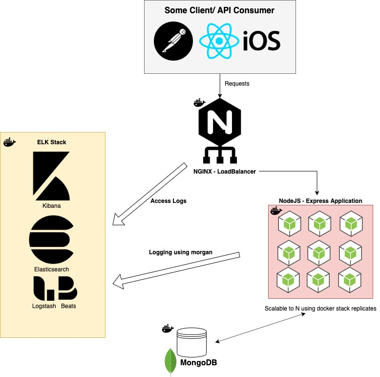

# Mechanic API
> A simple application with a REST API that can store and manage appointments for a car service center. Appointments are in a mongodb database.

## Objective
My understanding of the objective of this project was to evaluate my ability to code a production ready and scalable application. The application itself seemed straightforward enough to implement pretty simply therefore i focused on the details around making the application production ready and scalable. 

## Requirements
The scoping documentation did not go into too much detail of minimum requirements for the application. I find having a good understanding of the MVP (minimal viable product) helps focus the development on the areas of the project that matter.

* Functioning API that can:
  * Delete appointments from the database
  * Create new appointments
  * Update the status of an existing appointment
  * Retrieve a specific appointment from the database.
  * Retrieve all appointments that are scheduled between a date range and sorted by price.
* Simply Scalable
  * Applications should be able to scale without needing to re-engineer the application
* Logging
  * All applications have bugs (even in production) but what good is an application without the ability to keep, manage and analyze logs?  

## Architecture
This is the envisioned architecture for this project.  


In the real world the ELK stack and the Mongodb database would probably be independent of the loadbalancer and nodejs workers (as they could/would be used by other applications) but to make this project simpler I have combined them into one docker setup.

## Environment

This project was created on Mac os 10.14.6 using node v13.2.0 with docker v19.03.4. 


## API example & documentation

Here are a list of the API endpoints available to this application and the correct syntax for consuming the API.

* Get a list of appointments:
  * GET /appointments?start_time=2020-09-25T00:00:00Z&end_time=2020-09-26T00:00:00Z
     * Query Params
       * start_time = ISO_8601 date time
       * end_time = ISO_8601 date time
    
* Create an appointments:
  * POST /appointments
    ```json
    {
        "name": "Jonathan Segev",
        "type": "sedan", // possible options ['sedan', 'suv', 'van', 'bus']
        "start_time": "2020-09-25T00:00:00Z", // ISO_8601
        "end_time": "2020-09-25T00:30:00Z", // ISO_8601
        "price": 25.00,
        "status": "pending" // possible options ['pending', 'ongoing', 'completed']
    }
    ```
* Get a specific appointment from the db
  * GET /appointments/:appointmentId
     * Path Parameter
       * appointmentId = Mongodb Object ID
* Update an appointments:
  * PUT /appointments/:appointmentId
    ```json
    {
        "name": "Jonathan Segev",
        "type": "sedan", // possible options ['sedan', 'suv', 'van', 'bus']
        "start_time": "2020-09-25T00:00:00Z", // ISO_8601
        "end_time": "2020-09-25T00:30:00Z", // ISO_8601
        "price": 25.00,
        "status": "pending" // possible options ['pending', 'ongoing', 'completed']
    }
    ```
* Delete a specific appointment from the db
  * DELETE /appointments/:appointmentId
     * Path Parameter
       * appointmentId = Mongodb Object ID


## Development setup

Describe how to install all development dependencies and how to run an automated test-suite of some kind. Potentially do this for multiple platforms.

```sh
docker stack deploy -c docker-compose.yml mechanic-api
npm test
```

## Simulator setup

To simulate a real life business I used [artillery](https://artillery.io/) to simulate requests and [Faker](https://www.npmjs.com/package/Faker) to generate random data.
```sh
npm install
artillery run <name_of_simulation_from ./test/simulator.yml>
```

## Deployment setup

This project comes equipped with docker stack that spins up an ELK stack to handle logging, a mongodb database (although I recommend setting that up externally on maybe a cloud provider) as well as an nginx loadbalancer to distribute incoming requests to worker node process.  

You will first need to build the app and push it to a public container register (since docker stack only accepts pre-built images).
```sh
docker-compose build # & grab some coffee this could take a while
```

Once built you can then run
```sh
docker swarm init
docker stack deploy -c docker-stack.yml mechanic-api
```

If all goes well you can see our docker minions running by using 
```sh
docker stack services mechanic-api
# or
docker stack ps mechanic-api
```

If there are issues starting the docker env make sure you have enough memory and cpu allocated to docker then run:
```sh
docker swarm leave --force
docker swarm init
docker stack deploy -c docker-stack.yml mechanic-api
```


Simply scaling
```sh
docker service scale mechanic-api_nodeapp=40 #number of replicas
```

Our api should be available at localhost:80
You can also visit localhost:5601 to login to Kibana


## Testing
To run unit tests 
```sh
npm test 
```


## Improvements
Just some ideas on how this application could be better but probably beyond the scope of this assignment.

* Appointment locking to deal with race conditions as well as suggesting alternate slots when there is a conflict.
* Pagination for get appointments endpoint as there could be a lot

## Release History

* 0.0.1
    * Work in progress

## Meta

Jonathan Segev – Github:[@yonib05](https://github.com/yonib05) – Jsegev01@gmail.com

Distributed under the MIT license.


## Contributing

1. Fork it (<https://github.com/yonib05/machanic-api/fork>)
2. Create your feature branch (`git checkout -b feature/fooBar`)
3. Commit your changes (`git commit -am 'Add some fooBar'`)
4. Push to the branch (`git push origin feature/fooBar`)
5. Create a new Pull Request

## Libraries used 
- express - server side framework to simplify API implementation
- moment - for date parsing
- morgan - for logging
- mongoose - ODM for using mongodb
- babel - to use some unimplemented es7 features like import
- artillery - to help simulate real load testing as well pre-filling the database
- mocha - unit testing library
- chai - unit testing assertion library for mocha 
- chai-http - to help in testing the rest api

## Thanks
Credit where credit is due:
- https://github.com/pjburon/nginx-elk-docker for the inspiration to connect and configure an ELK stake to manage logging.
- https://levelup.gitconnected.com/set-up-a-nginx-load-balancer-for-a-dockerized-node-js-application-6bff1a54655a for the nginx load balancing concept.